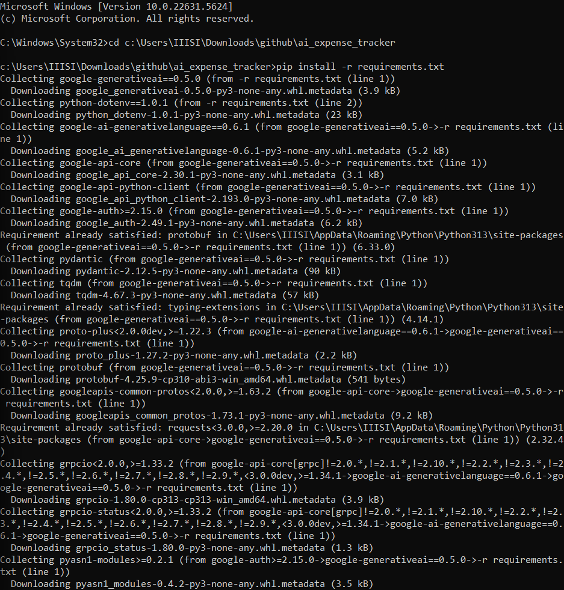
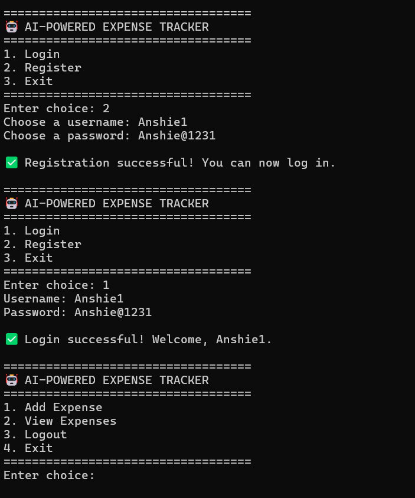
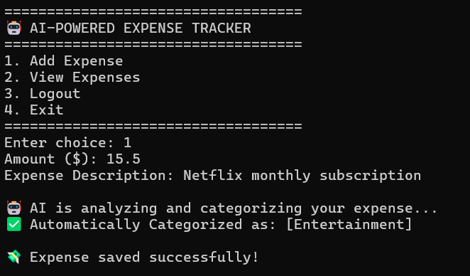
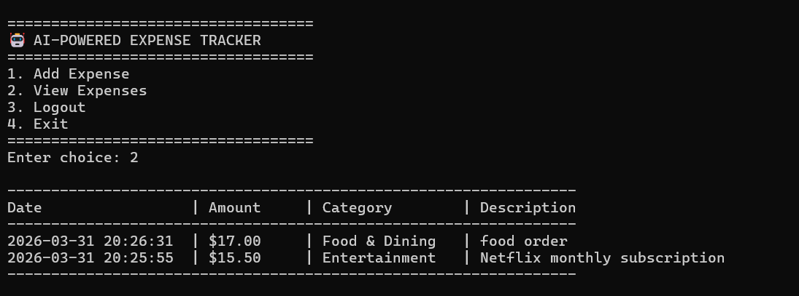
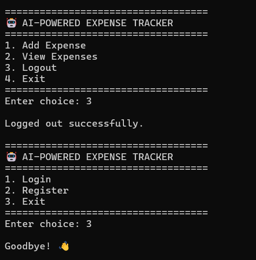

# AI Expense Tracker (BYOP Project)

Welcome to my submission for the "Bring Your Own Project" (BYOP) assignment for the Fundamentals of AI and ML course. This repository contains the complete source code, documentation, and logic for my terminal-based AI Expense Tracker.

## Table of Contents
1. [Introduction & Motivation](#introduction--motivation)
2. [What Problem Does This Solve?](#what-problem-does-this-solve)
3. [Key Features](#key-features)
4. [System Architecture & Tech Stack](#system-architecture--tech-stack)
5. [Complete Setup Guide](#complete-setup-guide)
6. [Step-by-Step Walkthrough (with Screenshots)](#step-by-step-walkthrough)
7. [How the AI Actually Works under the Hood](#how-the-ai-actually-works-under-the-hood)
8. [Database Schema](#database-schema)
9. [Future Enhancements](#future-enhancements)
10. [Acknowledgments](#acknowledgments)

---

## Introduction & Motivation
When we were assigned the BYOP project, I wanted to build something that was actually useful in my day-to-day life. I noticed that while I try to track my expenses to save money, it is usually a very tedious process. Most apps require you to manually click through endless dropdown menus just to specify that a $5 charge at Starbucks belongs in the "Food & Dining" category, or that an Uber ride is "Transport". 

I realized this is a perfect use case for Artificial Intelligence, specifically Natural Language Processing (NLP). I decided to build a fast, lightweight Command Line Interface (CLI) application in Python where I could just type exactly what I bought, and the AI would do the heavy lifting of categorizing it for me. It's built entirely for the terminal because CLI apps are fast, require very little overhead, and let you get in and out quickly. 

## What Problem Does This Solve?
- **Friction in Data Entry:** Typing "Bought 2 coffees for 10 bucks" takes 2 seconds. Clicking through a GUI, finding the date, typing the amount, and scrolling through 50 categories takes 30 seconds.
- **Inconsistent Categorization:** Sometimes you might categorize Amazon as "Shopping" and other times as "Groceries". An AI standardizes these inputs based on context.
- **Privacy Setup:** By using a local SQLite database, none of your financial history is stored on a random server (unless you want to export it later). The only thing sent to the cloud is the raw string of the item to be categorized.

## Key Features
- **Secure Authentication:** The app requires users to register and log in. Passwords are encrypted using SHA-256 hashing via Python's `hashlib`, meaning plaintext passwords are never saved.
- **Relational Data Storage:** Built on SQLite, ensuring that multiple users can use the same app on the same computer without seeing each other's data. 
- **Generative AI Integration:** Uses the Google Gemini 1.5 Flash model API to read your expense description and return a structured category.
- **Offline NLP Fallback:** If you don't have an internet connection, or if you didn't set up the API key, the app doesn't just crash. It seamlessly falls back to a custom local keyword-matching algorithm to categorize the text based on predefined arrays of keywords (like "uber", "flight", "netflix").
- **Formatted Tabular Views:** Pulls your expenses from the database and prints them back in an easy-to-read ASCII table format.

---

## System Architecture & Tech Stack
I intentionally kept the stack lightweight to ensure it runs immediately on any machine without complex Docker setups or heavy installations.

- **Language:** Python 3.8+
- **Database:** SQLite3 (Built into Python, no separate installation required)
- **AI/ML API:** Google Generative AI (`google-generativeai` package)
- **Environment Management:** `python-dotenv` for securely loading `.env` variables.

The codebase is split into three main logic files:
1. `main.py` - Handles the core `while` loop, the menus, user input parsing, and terminal printing.
2. `database.py` - Handles all SQL queries. Creates the tables if they don't exist, inserts new data, and fetches rows.
3. `ai_helper.py` - The bridge between the user's text and the Gemini AI model. Also contains the offline fallback dictionary.

---

## Complete Setup Guide

If you are grading this project or just want to run it on your own machine, follow these steps exactly.

### Step 1: Clone the Repository
First, you need to pull the code to your local machine:
```bash
git clone https://github.com/Anushka-Chatterjee-128/AI-Expense-Tracker.git
cd AI-Expense-Tracker
```

### Step 2: Set Up a Virtual Environment (Highly Recommended)
To avoid messing up your global Python packages, create a virtual environment inside the folder.

**If you are on Windows:**
```cmd
python -m venv venv
venv\Scripts\activate
```

**If you are on Mac or Linux:**
```bash
python3 -m venv venv
source venv/bin/activate
```

### Step 3: Install the Required Packages
Now install the necessary packages listed in `requirements.txt`. There are only two external dependencies (for the API and the environment variables).

```bash
pip install -r requirements.txt
```

### Step 4: Add Your Google Gemini API Key (Optional but recommended)
To see the actual Generative AI in action, you need to hook it up to Gemini.
1. Go to [Google AI Studio](https://aistudio.google.com/) and generate a free API key.
2. Look at the file named `.env.example` in this folder. Rename it to `.env`.
3. Open `.env` and replace `your_api_key_here` with your actual key.
```text
GEMINI_API_KEY=AIzaSyYourSecretKeyHere...
```
*(If you skip this step, the app will automatically detect it and use the local offline keyword matcher instead.)*

### Step 5: Start the App
You are ready to go! Start the main script:
```bash
python main.py
```

---

## Step-by-Step Walkthrough

Once you start the script, here is what you will experience.

### 1. Registering and Logging In
The first screen will ask you to login or register. Since it's your first time, press `2` to register. You will create a username and a password. Behind the scenes, `database.py` is hashing your password and storing it in the `users` table. Once registered, press `1` to log in with those credentials.


### 2. Adding an Expense using AI
Once logged in, your menu changes. Press `1` to add an expense.
It will ask for two things:
1. **Amount ($)** 
2. **Expense Description** 

I typed "uber to the airport" for $35.0. 
The app takes the string "uber to the airport", sends it to `ai_helper.py`, which prompts the Gemini model to classify it. In less than a second, it replied with "**Transport**". The app then saved that row to the SQLite database.


### 3. Viewing the Expense Table
After logging a few more items (e.g. buying a burger, paying the electric bill, getting a Netflix subscription), I can press `2` to view my expenses. 
`main.py` queries the DB for all expenses tied specifically to my `user_id`, orders them by the newest date first, and prints them in a highly readable ASCII table. Notice how the AI correctly categorized everything!


### 4. Logging Out and Exiting
When you are done, simply press `3` to log out, returning you to the main menu. From there you can log into a different account, or press `3` again to exit the program entirely.


---

## How the AI Actually Works under the Hood

The magic of this application happens inside `ai_helper.py`.

### Primary Mechanism (Generative AI)
When a user types a description, we wrap it in a carefully constructed prompt before sending it to the `gemini-1.5-flash` model:
> *"Categorize the following expense description into a single short category name (e.g., Food & Dining, Transport, Entertainment, Utilities, Shopping, Health, etc.). Just return the category name, nothing else. Description: [User Input]"*

By strictly prompting the AI to "Just return the category name, nothing else", we force an LLM (which usually loves to talk in long paragraphs) to act like a strict classification function. This allows us to take its exact text output and insert it straight into our database as a clean string.

### Failsafe Mechanism (Local NLP)
What if the user's internet drops? What if the API key is invalid? What if the Google servers are down?
I wrote a failsafe nested inside a `try/except` block. If the API call fails for *any* reason, it silently catches the error and drops down to a local dictionary mapping.

```python
FALLBACK_CATEGORIES = {
    "Transport": ["uber", "lyft", "taxi", "bus", "train", "flight"],
    "Entertainment": ["movie", "cinema", "game", "netflix", "spotify"]
}
```
It lowers the case of the user's description and scans it for these keywords. If it finds "netflix", it assigns "Entertainment". If it finds nothing, it assigns "Miscellaneous". This ensures the application never crashes and the user experience remains uninterrupted during grading or offline use!

---

## Database Schema

For those interested in the backend, here is the exact schema running in `expense_tracker.db`.

**Table: `users`**
| Column | Type | Constraints |
|--------|------|-------------|
| id | INTEGER | PRIMARY KEY, AUTOINCREMENT |
| username | TEXT | UNIQUE, NOT NULL |
| password_hash | TEXT | NOT NULL |

**Table: `expenses`**
| Column | Type | Constraints |
|--------|------|-------------|
| id | INTEGER | PRIMARY KEY, AUTOINCREMENT |
| user_id | INTEGER | FOREIGN KEY (users.id), NOT NULL |
| amount | REAL | NOT NULL |
| description | TEXT | NOT NULL |
| category | TEXT | NOT NULL |
| date | TEXT | NOT NULL |

---

## Future Enhancements
If I were to take this project further, here is what I would build next:
1. **Interactive Data Visualization:** While the terminal is text-based, libraries like `plotext` could allow me to render actual bar charts in the terminal showing spending by category.
2. **Export to CSV:** Allowing users to type a command to dump their monthly logging into an Excel-readable format.
3. **Budget Limits:** Hardcoding a budget (e.g., max $200 on Entertainment per month) and having the CLI warn the user when they are approaching that limit based on DB aggregate queries.

---

## Acknowledgments
- Built for the *Fundamentals of AI and ML* course as the final BYOP capstone project.
- Powered by Python 3 and Google's Generative AI.
